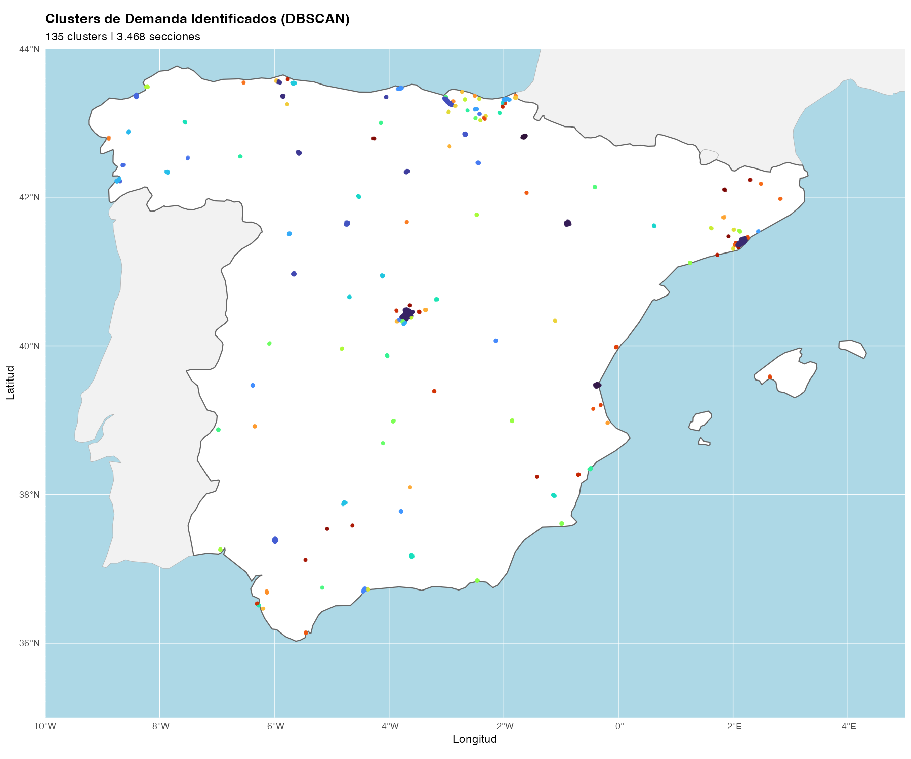

# L-SOMA: Location-Strategy Optimization & Market Analysis


## Abstract
**L-SOMA** is a Decision Support System (DSS) designed to optimize the expansion strategy of senior living networks. Moving beyond simple demographic density maps, this project applies **Quantum-inspired clustering vectors** and **Real-time Competitive Intelligence** to identify *Blue Ocean* opportunities in the Spanish market.

The system processes over **32,000 census sections**, evaluating them against a distinct 19-dimensional demographic target vector ($|\psi\rangle_{target}$) to maximize market resonance while minimizing competitive friction.

<p align="center">
  
</p>

## Mathematical Foundation
The core of the targeting algorithm relies on minimizing the divergence between the *Ideal Demographics Vector* ($Q$) and the *Candidate Section Vector* ($P$). We define the "Demographic State" of a census section as a normalized probability vector in a 19-dimensional Hilbert Space (representing age buckets):

$$ |\psi\rangle = \sum_{i=0}^{19} w_i |age\_bin_i\rangle $$

Where $w_i$ represents the weighted resonance of age group $i$. The suitability of a location is determined by the **Jensen-Shannon Divergence ($D_{JS}$)**, which offers a symmetric and smoothed metric superior to standard Kullback-Leibler divergence for demographic distributions:

$$ D_{JS}(P || Q) = \frac{1}{2} D_{KL}(P || M) + \frac{1}{2} D_{KL}(Q || M) $$

$$ \text{where } M = \frac{1}{2}(P + Q) $$

This mathematical rigor ensures that we identify areas not just with "old people", but with the *specific structural aging profile* that maximizes occupancy rates and operational efficiency.

## Key Visualizations

### The Resonance Matrix
The heatmap below illustrates the "Target Vector Q" detection across the national territory, highlighting areas of high demographic resonance.

<p align="center">
  
</p>

### Strategic Clusters (Top 10)
Identified clusters ranked by projected ROI and operational viability (min 85 beds).

<p align="center">
  
</p>

## Methodology & Pipeline

The project implements a rigorous data science pipeline:

1.  **Data Ingestion (`scripts/00-11`)**: ETL pipelines for Census (INE), Cadastre, and Household Income data.
2.  **Target Vector Definition (`scripts/07`)**: Construction of the mathematical target vector based on business logic (see `config.yaml`).
3.  **Geo-Clustering (`scripts/14`)**: DBSCAN spatial clustering using Haversine metric to identify continuous urban fabrics.
4.  **Viability Calculation (`scripts/15`)**: Assessment of Critical Mass satisfying the $N_{beds} \ge 85$ constraint.
5.  **Competitive Audit (`scripts/VALIDACION_COMPETENCIA`)**: Real-time validation of competitors via **Google Places API**, filtered for false positives.

## Project Structure
```bash
├── assets/                 # Visualization artifacts
├── config.yaml             # Centralized System Configuration
├── datos/                  # Data (GitIgnored for privacy/size)
├── informe/                # LaTeX Scientific Reports
├── scripts/                # Production Pipeline
│   ├── 00_bot_descarga.py  # Automated Data Ingestion
│   ├── 14_clustering_demanda.py # DBSCAN Algorithm
│   └── VALIDACION_COMPETENCIA_V4.py # Competitive Intelligence
└── requirements.txt        # Reproducibility Environment
```

## Requirements
- Python 3.9+ (Tested on 3.11 M2 Silicon)
- Libraries: `pandas`, `scikit-learn` (DBSCAN), `folium`, `requests`
- Google Cloud API Key (Places API)

## Configuration
The system is governed by `config.yaml`, separating logic from parameters:

```yaml
business:
  market_share_target: 0.03
  min_operational_beds: 85
competition:
  search_radius_meters: 1500
```

## License
This project is licensed under the MIT License - see the [LICENSE](LICENSE) file for details.

