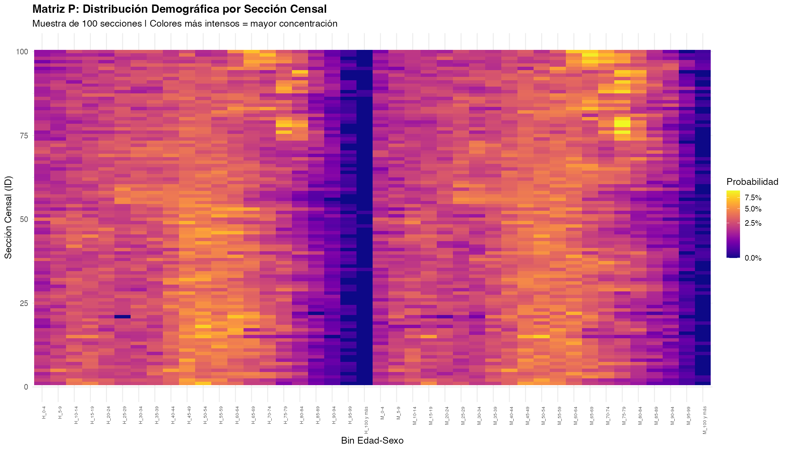
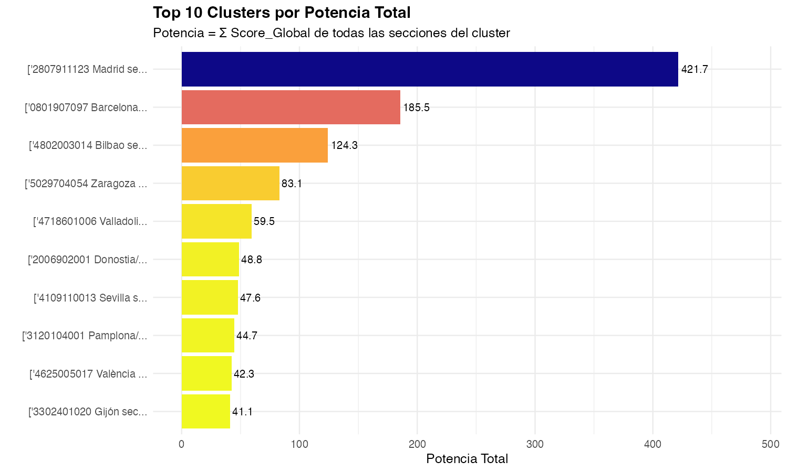
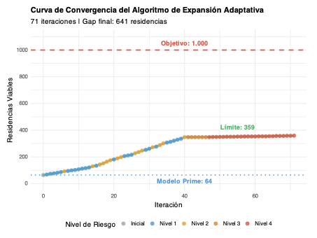

# L-SOMA: Location-Selection Optimization for Managed Aging


## 1. Motivation: The First-Principles Approach

This project addresses a critical complex system optimization problem: **Where to locate 1,000 new senior living units in a stochastic demographic landscape while ensuring a break-even occupancy rate >85%?**

Conventional expansion strategies rely on scalar metrics (e.g., "population > 65"). We hypothesize that **demand is not scalar, but vector-based**. The "Resonance" of a location depends on the structural shape of the aging pyramid ($|\psi\rangle$), latent variables such as caregiver burnout, and architectural determinism (accessibility of housing stock).

Our goal is not just to find "elderly populations", but to solve for the **Global Maxima of Demographic Resonance** in the Spanish territory.

> [!NOTE]
> **Research Basis**: This entire study is founded on the findings of the paper *Disparadores de Ingreso a Residencias Privadas*. The variables selected for the resonance vector derived directly from this clinical research.
> [📄 **Read Original Research (PDF)**](docs/Disparadores%20de%20Ingreso%20a%20Residencias%20Privadas.pdf)

## 2. Data Sources & Scope

* **Geographic Scope**: National-scale study of **Spain**, covering all **32,910 census sections**.
* **Primary Sources (INE - Instituto Nacional de Estadística)**:
    * **Demographics**: Spanish Census 2021-2025 (Gender and age distribution by 5-year bins).
    * **Economics**: Household Income Distribution Atlas 2023 (Average net income per household).
    * **Cartography**: 2024 Census Section Polygons (CUSEC) for spatial clustering.

## 3. Executive Summary

**The Problem**: The senior living market in Spain is fragmented. Organic growth is insufficient to meet the projected deficit. The challenge is to identify locations that maximize both social impact (coverage of need) and operational viability (financial sustainability).

**The Method**: We implemented a **Quantum-inspired Decision Support System (DSS)**. It evaluates 32,000+ census sections using **Jensen-Shannon Divergence ($D_{JS}$)** to measure the similarity between a section's demographic vector and an "Ideal Target Vector". This was combined with **DBSCAN clustering** to aggregate continuous urban fabrics and **Real-Time Competitive Auditing** via Google Places API to filter out saturated markets.

**The Conclusion**: The target of opening 1,000 new units organically is **unattainable**. The analysis reveals the Spanish market saturates between **64 (Prime Model)** and **359 (Expanded Model)** viable units. Beyond this point, marginal returns degrade by 95%.

> [!TIP]
> **Strategic Recommendation**: The expansion strategy must pivot from pure organic growth to **M&A (Mergers & Acquisitions)** to bridge the gap of ~640 units.
>
> [📄 **Download Full Technical Report (PDF)**](docs/informe_lsoma.pdf)

## 3. Mathematical Foundation

We define the state of a census section $P$ as a probability distribution in a Hilbert Space of 19 age dimensions. Optimal locations minimize the divergence from the Ideal Target Vector $Q$.

We utilize the **Jensen-Shannon Divergence**, a smoothed and symmetric version of Kullback-Leibler divergence, to quantify this "demographic distance":

$$ D_{JS}(P || Q) = \frac{1}{2} D_{KL}(P || M) + \frac{1}{2} D_{KL}(Q || M) $$

$$ \text{where } M = \frac{1}{2}(P + Q) $$

This metric is robust against zero-probability events (empty age bins) and provides a bounded score $[0, 1]$ used to rank every square kilometer of the country.

## 4. Key Visualizations

### The Demographic Resonance Matrix
The heatmap below visualizes the $D_{JS}$ score across the national territory. Hotspots indicate areas where the local demographic structure resonates perfectly with the business model.

<p align="center">
  
</p>

### Strategic Clusters (Blue Oceans)
Using DBSCAN, we aggregated resonance points into functional urban clusters. The bar chart below shows the **Top 10 Prime Clusters**, ranked by theoretical capacity (bed count).

<p align="center">
  
</p>

## 5. Advanced Optimization & Validation

### Adaptive Expansion Algorithm
The system performs a **Multi-Objective Iterative Search (71 iterations)**, relaxing risk parameters (occupancy thresholds and local competition) to find the structural limit of the market. Proving that demand is not infinite, the **Curve of Convergence** (Equation 9) shows how marginal returns diminish rapidly after the 359th cluster.

<p align="center">
  
</p>

### Market Saturation Analysis
We cross-reference demographic demand with **Real-Time Supply Data** (Google Places API).
*   **Saturation Index ($S_i$)**: Calculated for every viable cluster.
*   **Result**: 82.4% of theoretically viable locations were discarded due to high competitor density ($S_i > 0.8$).

### The "Blue Ocean" Insight
After filtering for saturation, the model identified **3 Premium Zones** with high demand ($D_{JS} < 0.1$) and low competition:
1.  **Madrid Centro**: High purchasing power, vertical aging.
2.  **Bilbao & Greater Basque Country**: High pension income, cultural fit.
3.  **Málaga Costa**: International retirees, premium segment.

## 6. Results: The Reality Frontier

The data proves that the market has a "hard limit". The graph below (Figure 4 from the report) demonstrates the **Curve of Diminishing Returns**. After the 359th cluster, the quality of the location drops below the operational safety threshold.

### Identified Blue Oceans ($Saturation < 0.2$)
The algorithm highlighted three primary zones with high demand and minimal competition:
1.  **Madrid Centro** (High purchasing power, vertical aging)
2.  **Bilbao & Greater Basque Country** (High pension income, cultural fit)
3.  **Málaga Costa** (International retirees, premium segment)

## Project Structure
```bash
├── assets/                 # Visualization artifacts (Maps, Heatmaps)
├── config.yaml             # Centralized System Configuration
├── docs/                   # Technical Reports (PDF)
├── datos/                  # Data (GitIgnored for privacy/size)
├── scripts/                # Production Pipeline
│   ├── 00_bot_descarga.py  # Automated Data Ingestion
│   ├── 14_clustering_demanda.py # DBSCAN Algorithm
│   └── VALIDACION_COMPETENCIA_V4.py # Competitive Intelligence
└── requirements.txt        # Reproducibility Environment
```

## Requirements & Usage
The system is governed by `config.yaml`. To reproduce the analysis:

1.  Clone the repo: `git clone https://github.com/jmomjam/senior-care-location-optimization-spain.git`
2.  Install requirements: `pip install -r requirements.txt`
3.  Set your `GOOGLE_API_KEY` in `.env`.
4.  Run the pipeline scripts.

## License
This project is licensed under the MIT License - see the [LICENSE](LICENSE) file for details.

